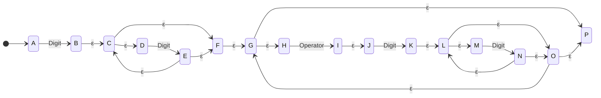
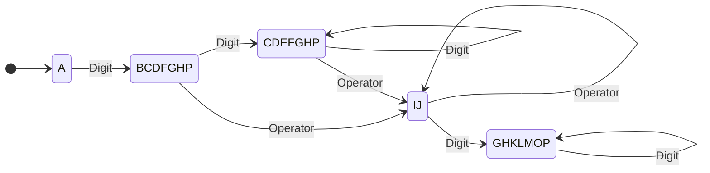
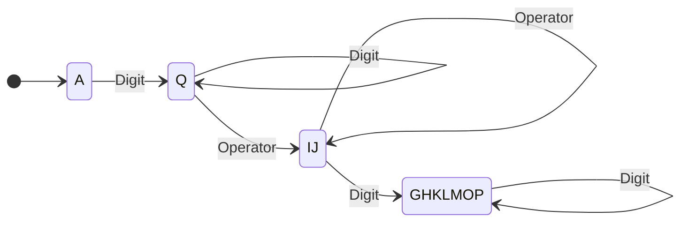
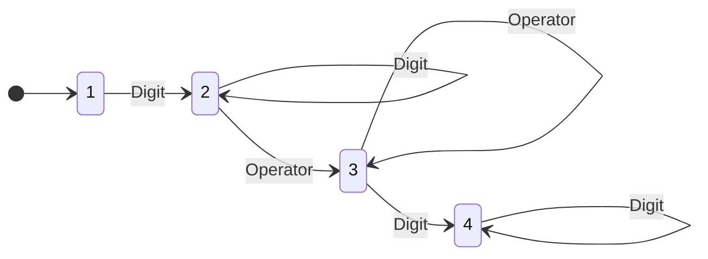

3 Лабораторная работа №1.\
Распознавание и поиск лексем

Теоретические сведения

Общие сведения

*Лексический анализатор* (сканер) --- это часть транслятора, которая
считывает символы программы на исходном языке и строит из них слова
(лексемы) этого языка. На вход лексического анализатора поступает текст
исходной программы, а выходная информация представляет собой поток
токенов, который передаётся для дальнейшей обработки на этап
синтаксического анализа.

Состав лексем, выделяемых лексическим анализатором, а также множество
решаемых им вспомогательных задач могут изменяться в зависимости от
особенностей исходного языка, а также принятых разработчиком транслятора
архитектурных и инженерных решений. Тем не менее, как правило, сканер
решает три основные задачи:

- выделение лексем языка;

- классификация выделенных лексем;

- удаление лексем, не влияющих на смысл программы.

*Лексема* --- группа символов, имеющих в исходном языке самостоятельное
значение. В зависимости от того, какую роль та или иная лексема играет в
исходном языке, её относят к одному из классов лексем (токенов). В
большинстве языков программирования выделяются следующие классы токенов:

- идентификаторы;

- литералы (строковые, числовые и др. константы);

- ключевые слова;

- комментарии;

- блоки пробельных символов;

- знаки операций;

- символы-разделители.

В случае, если лексическому анализатору не удаётся выделить или
классифицировать ту или иную лексему, говорят об ошибке в исходной
программе. Как правило, такие ошибки связаны с использованием в тексте
программы недопустимых символов, ошибками в записи числовых и строковых
литералов и т.д.

К лексемам, не влияющим на смысл программы, в большинстве языков
относятся комментарии и блоки пробельных символов. На обработку
синтаксическому анализатору соответствующие этим лексемам токены, как
правило, не передаются.

Регулярные языки и конечные автоматы

Для большинства компьютерных языков множества корректных лексем образуют
регулярные языки. *Регулярными выражениями* называется способ задания
регулярных языков (метаязык), который задаётся следующей грамматикой:

R → ε

\| \'c\'

\| R + R

\| RR

\| R\*

причём справедливы следующие равенства:

где  --- функция значения, задающая соответствие
между регулярным выражением  и множеством
соответствующих ему строк.

Кроме того, для удобства обозначений часто используются расширенные
конструкции, некоторые из них приведены в таблице 2.

Таблица 2 --- Расширенные конструкции регулярных выражений

  -----------------------------------------------------------------------
  Расширенная конструкция             Эквивалентная базовая конструкция
  ----------------------------------- -----------------------------------
  A \| B                              A + B

  A+                                  AA\*

  \[A--Za--z\$%\]                     \'A\' \| \'B\' \| ... \| \'Z\' \|
                                      \'a\' \| \'b\' \| ... \| \'z\' \|
                                      \'\$\' \| \'%\'

  A?                                  A + ε
  -----------------------------------------------------------------------

Для выделения лексем используются конечные автоматы. Математически
доказано, что следующие множества языков эквивалентны:

- языки, которые могут быть обработаны конечными автоматами;

- языки, которые могут быть заданы регулярными выражениями;

- регулярные языки.

*Конечным автоматом* называют математическую абстракцию, которую можно
рассматривать как некоторое устройство, в каждый момент времени
находящееся в одном из конечного множества состояний, а также имеющего
один вход (на которые подаются сигналы извне) и один выход (на который
подаются выходные сигналы, сформированные автоматом). Как правило, в
теории трансляторов выходные сигналы конечных автоматов не
рассматриваются, внимание уделяется только состояниям и входным
сигналам.

Таким образом, конечный автомат задаётся пятёркой ,
где  --- конечное множество состояний автомата,
 --- конечное множество допустимых входных
сигналов,  --- множество переходов, являющееся
отображением ,  --- начальное
состояние автомата,   --- множество заключительных
(допускающих) состояний автомата.

Работа автомата выполняется по тактам. На каждом такте
 автомат, находясь в некотором состоянии
, считывает очередной сигнал (символ)
 и входной цепочки символов и изменяет своё
состояние на . При этом указатель в цепочке
входных символов передвигается на следующий символ и начинается такт
. Так продолжается до тех пор, пока цепочка
входных символов не закончится. Считается также, что перед тактом 1
автомат находится в начальном состоянии .

Говорят, что автомат *допускает* («accept») цепочку символов, если в
результате выполнения всех тактов обработки этой цепочки он оказывается
в состоянии . Если же такое состояние не
достигнуто (автомат находится не в заключительном состоянии или не смог
выполнить переход при поступлении очередного сигнала), говорят, что
автомат *не допускает* («reject») цепочку символов.

Конечный автомат часто изображается диаграммой переходов --- взвешенным
ориентированным графом, вершинами которого являются состояния, а
дугами --- переходы, причём дуги помечены сигналами, по которым такие
переходы происходят. В дальнейшем для удобства будут применяться
обозначения, приведённые в таблице 3.

Таблица 3 --- Обозначения, используемые в диаграммах переходов

  -----------------------------------------------------------------------------------------
  Обозначение                                           Смысл
  ----------------------------------------------------- -----------------------------------
  {width="0.7652777777777777in"   Состояние автомата
  height="0.6916666666666667in"}                        

  {width="1.0618055555555554in"   Начальное состояние автомата
  height="0.7409722222222223in"}                        

  {width="0.7409722222222223in"   Заключительное состояние автомата
  height="0.49375in"}                                   

  {width="2.209722222222222in"    Переход по сигналу a
  height="0.6541666666666667in"}                        
  -----------------------------------------------------------------------------------------

Существует также особый вид переходов --- *ε-переходы*. Такие переходы
позволяют автомату изменять своё внутреннее состояние без поглощения
символа входной цепочки.

Конечные автоматы принято разделять на детерминированные и
недетерминированные. Для того, чтобы конечный автомат был
*детерминированным* (ДКА), должно выполняться два условия:

- из любого состояния  по любому сигналу
   должно существовать не более одного перехода
  ;

- в автомате не должно быть ε-переходов.

Если хотя бы одно из этих условий не выполняется, автомат называют
*недетерминированным* (НКА).

Разработка лексического анализатора

В общем случае построение лексического анализатора включает в себя
следующие этапы:

- подготовка лексической спецификации;

- запись регулярных выражений по лексической спецификации;

- построение НКА по регулярным выражениям;

- преобразование НКА в ДКА;

- программная реализация полученного ДКА.

В роли лексической спецификации может выступать любое описание лексем,
подлежащих выделению и распознаванию. Программная реализация может
производиться не только для ДКА, но и для НКА: в этом случае становится
возможной реализация некоторых расширенных конструкций регулярных
выражений за счёт снижения производительности.

Рассмотрим пример программной реализации конечного автомата,
допускающего строки, состоящие из целых чисел, разделённых знаками
операций +, --, \* и /.

Составим регулярное выражение, задающее такие строки.

\[0--9\]+ ((\'+\' \| \'--\' \| \'\*\' \| \'/\') \[0--9\]+)\*

Очевидно, что включение в конечный автомат отдельных дуг для каждого
возможного сигнала в данном случае нецелесообразно, поэтому разделим все
возможные входные сигналы на классы и перепишем регулярное выражение
следующим образом:

// Классы символов:

*Digit* ::= \[0--9\]

*Operator* ::= \'+\' \| \'--\' \| \'\*\' \| \'/\'

// Регулярное выражение для допустимых строк:

*ValidString* ::= *Digit*+ (*Operator* *Digit*+)\*

Построим НКА для данного регулярного выражения, используя для пометки
дуг классы символов:

Рисунок 2. Пример НКА

Выполним преобразование полученного НКА в ДКА, заменяя множества
состояний НКА на одиночные состояния ДКА путём вычисления ε-замыканий
соответствующих множеств состояний. Диаграмма переходов соответствующего
автомата приведена на рисунке 3.

Рисунок 3. Пример эквивалентного ДКА

Обратим внимание на то, что полученный ДКА не является оптимальным, т.к.
состояния BCDFGHP и CDEFGHP имеют абсолютно идентичные правила переходов
и оба являются заключительными. Это означает, что можно заменить их
одним состоянием, как показано на рисунке 4.

Рисунок 4. Пример оптимизированного эквивалентного ДКА

Заменим имена состояний на номера начиная с 1, как показано на
рисунке 5.

Рисунок 5. Пример ДКА, готового к программной реализации

Полученный автомат готов к программной реализации. Следует обратить
внимание на то, что нахождение полученного ДКА в каждом из состояний
может быть охарактеризовано с терминах решаемой задачи, как показано в
таблице 4.

Таблица 4 --- Значение состояний полученного ДКА

+-------------+--------------------------------------------------------+
| № состояния | Значение                                               |
+=============+========================================================+
| 1           | Прочитано: ничего.                                     |
|             |                                                        |
|             | Ожидается: цифры первого числа.                        |
+-------------+--------------------------------------------------------+
| 2           | Прочитано: одна или несколько цифр.                    |
|             |                                                        |
|             | Ожидается: новые цифры первого числа, знак операции    |
|             | или конец строки.                                      |
+-------------+--------------------------------------------------------+
| 3           | Прочитано: знак операции.                              |
|             |                                                        |
|             | Ожидается: цифры следующего числа.                     |
+-------------+--------------------------------------------------------+
| 4           | Прочитано: одна или несколько цифр.                    |
|             |                                                        |
|             | Ожидается: новые цифры числа, знак операции или конец  |
|             | строки.                                                |
+-------------+--------------------------------------------------------+

Для программной реализации ДКА потребуются:

- переменная State;

- двумерный массив-константа Transitions;

- одномерный массив-константа IsFinalState.

Реализуем полученный ДКА на языке Pascal. Для удобства реализации
вводится дополнительное состояние 0, в которое автомат переходит в
случае отсутствия соответствующего перехода на диаграмме переходов и в
котором остаётся до перезапуска. Кроме того, для повышения
сопровождаемости кода используются объявления вспомогательных типов.

**type**

TCharType = (ctUnknown, ctDigit, ctOperator);

TState = 0..4;

**const**

Transitions: **array** \[TState, TCharType\] **of** TState =

(

(0, 0, 0), // Состояние «Ошибка»

(0, 2, 0), // Состояние «Ждём первое число»

(0, 2, 3), // Состояние «Читаем первое число, ждём знака»

(0, 4, 0), // Состояние «Ждём следующее число»

(0, 4, 3) // Состояние «Читаем число, ждём знака»

);

IsFinalState: **array** \[TState\] **of** Boolean =

(False, False, True, False, True);

Реализуем также вспомогательную функцию, выполняющую классификацию
символа.

**function** GetCharType(C: Char): TCharType;

**begin**

**case** C **of**

\'0\'..\'9\':

Result := ctDigit;

\'+\', \'--\', \'\*\', \'/\':

Result := ctOperator;

**else**

Result := ctUnknown;

**end**;

**end**;

Программная реализация непосредственно конечного автомата сводится к
простому циклу по элементам строки.

**function** CheckString(**const** S: **String**): Boolean;

**var**

i: Integer;

State: TState;

**begin**

State := 1;

**for** i := 1 **to** Length(S) **do**

State := Transitions\[State, GetCharType(S\[i\])\];

Result := IsFinalState\[State\];

**end**;

Полученная функция может использоваться для проверки строки на
соответствие исходной лексической спецификации. Аналогичным образом
реализуется и функция выделения лексемы из начала строки.

Задание

Для заданного вариантом вида текстовых данных проанализировать
допустимые значения и разработать:

- **регулярное выражение**;

- **НКА** для этого регулярного выражения;

- **эквивалентный ДКА** и его **таблицу переходов**;

- **программное средство**, реализующее работу этого ДКА.

Программное средство должно поддерживать следующие возможности:

- проверка корректности произвольной строки;

- поиск всех подстрок, соответствующих требованиям, в произвольной
  строке.

Таблица 5 --- Варианты заданий к лабораторной работе №1

+----------+-------------------------------+----------------------------------------------+
| №        | Требования                    | Примеры корректных строк                     |
| варианта |                               |                                              |
+==========+===============================+==============================================+
| 1        | Строковый литерал языка C с   | \"Hello, world!\"                            |
|          | поддержкой следующих          |                                              |
|          | экранирующих                  | \"This \\\"string\\\" is valid.\"            |
|          | последовательностей:          |                                              |
|          |                               | \"Hello\\nworld\\t!\"                        |
|          | - \\n                         |                                              |
|          |                               | \"Quotes are written this way: \\\\\\\".\"   |
|          | - \\t                         |                                              |
|          |                               |                                              |
|          | - \\\\                        |                                              |
|          |                               |                                              |
|          | - \\\"                        |                                              |
+----------+-------------------------------+----------------------------------------------+
| 2        | Строковый литерал языка       | \'Hello, world!\'                            |
|          | Pascal (апостроф              |                                              |
|          | записывается, как два         | \'I don\'\'t know.\'                         |
|          | апострофа подряд).            |                                              |
+----------+-------------------------------+----------------------------------------------+
| 3        | 16-чное число в синтаксисе C  | \$c001c0De                                   |
|          | или Pascal.                   |                                              |
|          |                               | 0xCa5EFeED                                   |
+----------+-------------------------------+----------------------------------------------+
| 4        | Классический абсолютный путь  | C:\\Windows\\winmine.exe                     |
|          | к файлу в Windows:            |                                              |
|          |                               | D:\\WebServer\\home\\site.by\\www\\.htaccess |
|          | - латинская буква от A до Z;  |                                              |
|          |                               | Z:\\autoexec.bat                             |
|          | - двоеточие;                  |                                              |
|          |                               | N:\\testfile.                                |
|          | - обратный слеш;              |                                              |
|          |                               | X:\\testfile2                                |
|          | - 0 или более блоков из       |                                              |
|          |   допустимых символов,        |                                              |
|          |   разделённых обратными       |                                              |
|          |   слешами.                    |                                              |
|          |                               |                                              |
|          | К допустимым относятся все    |                                              |
|          | символы, кроме «\*», «\|»,    |                                              |
|          | «\\», «:», «\"», «\<», «\>»,  |                                              |
|          | «?» и «/».                    |                                              |
|          |                               |                                              |
|          | (Для поиска подстрок          |                                              |
|          | недопустимым символом пути    |                                              |
|          | следует также считать пробел  |                                              |
|          | « ».)                         |                                              |
+----------+-------------------------------+----------------------------------------------+
| 5        | Двоичное, восьмеричное или    | 01101011B                                    |
|          | 16-чное число в синтаксисе    |                                              |
|          | FASM (постфиксная форма       | 54212110o                                    |
|          | записи). 16-чное число должно |                                              |
|          | начинаться с цифры от 0 до 9. | 51245H                                       |
|          |                               |                                              |
|          |                               | 0B8Ch                                        |
+----------+-------------------------------+----------------------------------------------+
| 6        | Корректный идентификатор:     | abCde                                        |
|          | начинается с буквы или        |                                              |
|          | нижнего подчёркивания,        | x0                                           |
|          | затем --- произвольное        |                                              |
|          | количество букв, цифр и/или   | Y                                            |
|          | нижних подчёркиваний.         |                                              |
|          |                               | z_1                                          |
|          |                               |                                              |
|          |                               | test_value_is_here                           |
|          |                               |                                              |
|          |                               | \_                                           |
|          |                               |                                              |
|          |                               | \_\_custom                                   |
+----------+-------------------------------+----------------------------------------------+
| 7        | Адрес электронной почты       | test@localhost                               |
|          | (упрощённо).                  |                                              |
|          |                               | vasya@pupkin.ru                              |
|          | Имя ящика --- произвольный    |                                              |
|          | набор букв, цифр и символов   | ivan.ivanov@mail.bsuir.by                    |
|          | «.» (точка). Доменное имя --- |                                              |
|          | одна или более групп,         | a.b.c@d-e-f.com                              |
|          | состоящих из букв, цифр и     |                                              |
|          | дефисов, разделённые точками. |                                              |
+----------+-------------------------------+----------------------------------------------+
